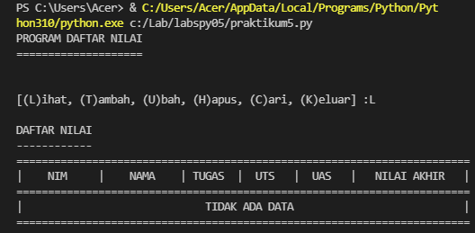
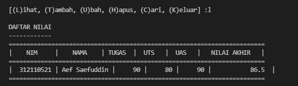

# **Tugas Pertemuan 10**

```sh
Nama    : Aef Saefuddin
Nim     : 312110521
Kelas   : TI.21.C5
MatKul  : Pemrograman
```

# **Latihan 1**

Berikut adalah Soal dari Latihan 1


## *Syntax*

Dari Soal Yang Ada Diatas Kita Bisa Menggunakan *Syntax* Yang Ada Dibawah Ini

```sh
daftarkontak = {"Nama":"Nomor Telepon"}
kontak = {'Ari':'081267888', 'Dina':'087677776'}

print("="*30)
print("   Nama     |    Nomor Telepon   ")
print("="*30)
print(" # Ari   |   ",kontak['Ari'])
print(" # Dina  |   ",kontak['Dina'])
print("="*30)

# Menampilkan kontak Ari
print("Menampilkan kontak Ari")
print("="*30)
print(" # Ari   |   ",kontak['Ari'])
print("="*30)

#Menambahkan kontak dengan nama Riko dan nomor 087654544
print("Menambah kontak dengan dana Riko dan Nomor Telepon 087654544")
kontak['Riko']='087654544'
print("="*30)
print("  Riko   |   ",kontak['Riko'])
print("="*30)

#Mengubah kontak Dina dengan nomor baru 0889999776
print("Mengubah kontak Dina dengan nomor baru 0889999776")
kontak['Dina']='0889999776'
print("="*30)
print(" # Dina  |   ",kontak['Dina'])
print("="*30)
#Menampilkan semua nama
print("Menampilkan semua nama")
print("="*30)
print(kontak.keys())
print("="*30)
#Menampilkan semua nomor
print("Menampilkan semua nomor")
print("="*30)
print(kontak.values())
print("="*30)
#Menampilkan semua daftar kontak beserta nama dan nomornya
print("Menampilkan daftar nama dan nomor")
print("="*30)
print(kontak.items())
print("="*30)
#Menghapus kontak Dina
print("Hapus kontak Dina")
kontak.pop('Dina')
print("="*30)
print(kontak.items())
print("="*30)
```
## *Output*

Hasil dari *Syntax* diatas adalah yang ada pada *Output* dibawah ini.


# **Praktikum 5**

Berikut adalah Soal dari Praktikum 5


## *Syntax*

Dari Soal yang ada Kita Dapat Menggunakan *Syntax* dibawah ini.

```sh
print("PROGRAM DAFTAR NILAI")
print("====================")
print()
data={}
while True:
    print()
    a=input("[(L)ihat, (T)ambah, (U)bah, (H)apus, (C)ari, (K)eluar] :")
    print()

    if a=="t" or a=="T":
        print("TAMBAH DATA")
        print("-----------")
        nim=int(input("NIM\t: "))
        nama=input("Nama\t: ")
        tugas=int(input("Tugas\t: ")) 
        uts=int(input("UTS\t: "))
        uas=int(input("UAS\t: "))
        akhir=(int(tugas)*30/100)+(int(uts)*35/100)+(int(uas)*35/100)
        data[nim]=nama, tugas, uts, uas, akhir
        print()

    elif a=="l" or a=="L":
        if data.items():
            print("DAFTAR NILAI")
            print("------------")
            print(72*"=")
            print("| {0:^10} | {1:^10} | {2:^6} | {3:^6} | {4:^6} |   {5:^12}  |".format("NIM", "NAMA", "TUGAS", "UTS", "UAS", "NILAI AKHIR"))
            print(72*"=")
            for item in data.items(): 
                print("| {0:>10} | {1:>10} | {2:>6} | {3:>6} | {4:>6} |   {5:>12}  |".format(nim, nama, tugas, uts, uas, akhir))
                print(72*"=")
            print()
        else:
            print("DAFTAR NILAI")
            print("------------")
            print(72*"=")
            print("| {0:^10} | {1:^10} | {2:^6} | {3:^6} | {4:^6} |   {5:^12}  |".format("NIM", "NAMA", "TUGAS", "UTS", "UAS", "NILAI AKHIR"))
            print(72*"=")
            print("|                             TIDAK ADA DATA                           |")
            print(72*"=")
            print()

    elif a=="u" or a=="U":
        print("UBAH DATA")
        print("---------")
        b=input("Masukkan NIM anda: ")
        print()
        if data.keys():
            tugas=int(input("Tugas\t: ")) 
            uts=int(input("UTS\t: "))
            uas=int(input("UAS\t: "))
            akhir=(int(tugas)*30/100)+(int(uts)*35/100)+(int(uas)*35/100)

    elif a=="h" or a=="H":
        print("HAPUS DATA")
        print("----------")
        b=input("Masukkan NIM anda: ")
        print()
        if data.keys():
            del data[nim]
                   
    elif a=="c" or a=="C":
        print("CARI DATA")
        print("---------")
        b=input("Masukkan NIM anda: ")
        print()
        if data.keys():
            print(72*"=")
            print("| {0:^10} | {1:^10} | {2:^6} | {3:^6} | {4:^6} |   {5:^12}  |".format("NIM", "NAMA", "TUGAS", "UTS", "UAS", "NILAI AKHIR"))
            print(72*"=")
            print("| {0:>10} | {1:>10} | {2:>6} | {3:>6} | {4:>6} |   {5:>12}  |".format(nim, nama, tugas, uts, uas, akhir))
            print(72*"=")
            print()
            
    elif a=="k" or a=="K":
         break
``` 

## *Penjelasan*
1. Membuat Dictonary Kosong yang akan Di Input Dengan Data

```sh
data={}
```

2. Membuat Perulangan dengan *While* yang terdapat pada Menu untuk Menjalankan Program.

```sh
while True:
print()
a=input("[(L)ihat, (T)ambah, (U)bah, (H)apus, (C)ari, (K)eluar] :")
print()
```

3. Menambahkan Data Yang Dibutuhkan Seperti Data ***Nim*, *Nama*, *Nilai Tugas*, *Uts*, dan *Uas*.** Data yang Di Input akan Masuk ke Dalam Dictonary **Data** dengan **Nim** sebagai keys sedangkan nama, tugas, uts dan uas sebagai **Values**

```sh
if a=="t" or a=="T":
    print("TAMBAH DATA")
    print("-----------")
    nim=int(input("NIM\t: "))
    nama=input("Nama\t: ")
    tugas=int(input("Tugas\t: ")) 
    uts=int(input("UTS\t: "))
    uas=int(input("UAS\t: "))
    akhir=(int(tugas)*30/100)+(int(uts)*35/100)+(int(uas)*35/100)
    data[nim]=nama, tugas, uts, uas, akhir
```

4. Menampilkan atau Melihat *Data*. Jika Sebelumnya belum Menginputnya Maka Tampilan *"Tidak Ada"*. Apabila sudah Menginput *Data*. Maka Data Akan Ditampilkan.

```sh
elif a=="l" or a=="L":
    if data.items():
        print("DAFTAR NILAI")
        print("------------")
        print(72*"=")
        print("| {0:^10} | {1:^10} | {2:^6} | {3:^6} | {4:^6} |   {5:^12}  |".format("NIM", "NAMA", "TUGAS", "UTS", "UAS", "NILAI AKHIR"))
        print(72*"=")
        for item in data.items(): 
            print("| {0:>10} | {1:>10} | {2:>6} | {3:>6} | {4:>6} |   {5:>12}  |".format(nim, nama, tugas, uts, uas, akhir))
            print(72*"=")
        print()
    else:
        print("DAFTAR NILAI")
        print("------------")
        print(72*"=")
        print("| {0:^10} | {1:^10} | {2:^6} | {3:^6} | {4:^6} |   {5:^12}  |".format("NIM", "NAMA", "TUGAS", "UTS", "UAS", "NILAI AKHIR"))
        print(72*"=")
        print("|                             TIDAK ADA DATA                           |")
        print(72*"=")
        print()
```

5. Apabila Ingi Mengubah *Data*, maka Anda akan diminta untuk menginputkan kembali *Nim* yang Telah Di Input. Setelah Itu Data apat Diubah.

```sh
 elif a=="u" or a=="U":
    print("UBAH DATA")
    print("---------")
    b=input("Masukkan NIM anda: ")
    print()
    if data.keys():
        tugas=int(input("Tugas\t: ")) 
        uts=int(input("UTS\t: "))
        uas=int(input("UAS\t: "))
        akhir=(int(tugas)*30/100)+(int(uts)*35/100)+(int(uas)*35/100)
```

6. Jika Ingin Menghapus *Data*, anda akan Diminta Menginputkan *Nim* Nya kemabli. Lalu *Data* yang telah Di Input sejak Awal akan terhapus beserta ***Valuesnya*** (Nama, Nilai Tugas, Nilai Uts, dan NIlai Uas).

```sh
elif a=="h" or a=="H":
    print("HAPUS DATA")
    print("----------")
    b=input("Masukkan NIM anda: ")
    print()
    if data.keys():
        del data[nim]
```

7. Jika Ingin Mencari *Data*. Anda Akan Diminta Unutk Menginputkan ***Nim*** Kemudian *Data* yang Anda cari akan muncul.

```sh
elif a=="c" or a=="C":
    print("CARI DATA")
    print("---------")
    b=input("Masukkan NIM anda: ")
    print()
    if data.keys():
        print(72*"=")
        print("| {0:^10} | {1:^10} | {2:^6} | {3:^6} | {4:^6} |   {5:^12}  |".format("NIM", "NAMA", "TUGAS", "UTS", "UAS", "NILAI AKHIR"))
        print(72*"=")
        print("| {0:>10} | {1:>10} | {2:>6} | {3:>6} | {4:>6} |   {5:>12}  |".format(nim, nama, tugas, uts, uas, akhir))
        print(72*"=")
        print()
```

8. Setelah Sudah Selesai Meginputkan *Data*, Pilih **'k'/K'** maka Program akan Terhenti.

```sh
elif a=="k" or a=="K":
     break
```

## *Output*






## *Flowchart*
Dibawah Ini Flowchart Pada Data Diatas.


**SEKIAN DAN TERIMA KASIH**